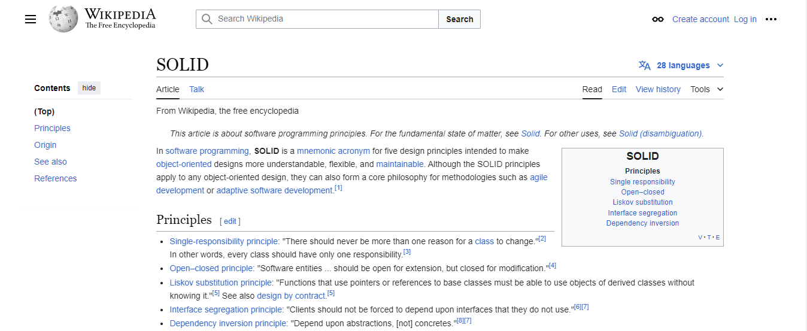

## [SOLID Principles](https://en.wikipedia.org/wiki/SOLID) in Python with examples 👨‍💻📚

* [Single Responsibility Principle](https://github.com/ArtemLeo/SOLID-principles-in-Python-with-examples/blob/main/SingleResponsibilityPrinciple.ipynb)
* [Open/Closed Principle](https://github.com/ArtemLeo/SOLID-principles-in-Python-with-examples/blob/main/OpenClosedPrinciple.ipynb)
* [Liskov Substitution Principle](https://github.com/ArtemLeo/SOLID-principles-in-Python-with-examples/blob/main/LiskovSubstitutionPrinciple.ipynb)
* [Interface Segregation Principle](https://github.com/ArtemLeo/SOLID-principles-in-Python-with-examples/blob/main/InterfaceSegregationPrinciple.ipynb)
* [Dependency Inversion Principle](https://github.com/ArtemLeo/SOLID-principles-in-Python-with-examples/blob/main/DependencyInversionPrinciple.ipynb)

